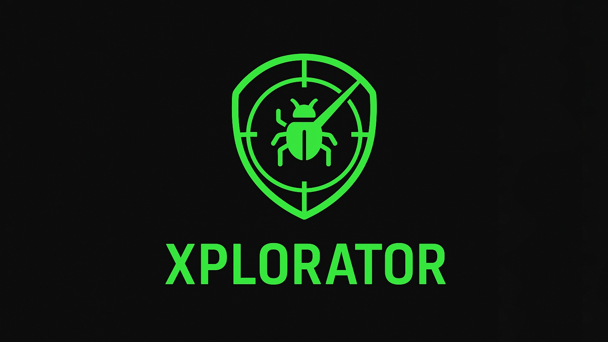

<p align="center">
  
</p>

<p align="center">
  
  
  
  
  
  
  
  
  <a href="https://github.com/KalloloCoder">
    
  </a>
</p>

# XPLORATOR

XPLORATOR adalah **tool edukasi bug hunting / security testing** berbasis CLI sederhana, ditulis dengan **Ruby**.  
Tujuannya untuk belajar dasar **reconnaissance, payload generation, obfuscation, local testing**, dan **reporting** dalam proses eksplorasi keamanan aplikasi web.

> Disclaimer: Tool ini dibuat untuk **pembelajaran & penelitian**. Segala penyalahgunaan bukan tanggung jawab penulis.

---

## Struktur Project
```
XPLORATOR/
├── xplorator.rb          # Main CLI untuk menjalankan tool
├── modules/              # Berisi modul-modul utama
│   ├── recon.rb          # Modul reconnaissance (subdomain / endpoint scan)
│   ├── pocgen.rb         # Modul untuk membuat PoC payload sederhana
│   ├── obfuscator.rb     # Modul encoding/obfuscation payload (URL, Base64, Hex)
│   ├── playground.rb     # Modul local server testing (WEBrick @ localhost:8000)
│   └── report.rb         # Modul membuat laporan hasil scan (markdown/txt)
├── data/
│   └── wordlist.txt      # Wordlist pendukung untuk scanning
├── README.md             # Dokumentasi project
└── LICENSE               # Lisensi project
```

---

## Cara Kerja

1. **Jalankan CLI utama**
   ```bash
   ruby xplorator.rb
   ```
Tool akan menampilkan menu pilihan modul.

2. **Pilih modul sesuai kebutuhan:**

Recon → melakukan enumerasi (contoh: subdomain, endpoint).

PoC Generator → membuat payload bukti konsep untuk uji coba.

Obfuscator → mengubah payload ke bentuk URL Encode, Base64, atau Hex.

Playground → menjalankan server lokal di `http://localhost:8000` untuk testing.

Report → menyimpan hasil eksplorasi ke dalam file laporan.

---

## Fitur Modul

- Reconnaissance (recon.rb)

Membantu melakukan eksplorasi awal target.
Memanfaatkan wordlist (data/wordlist.txt) untuk enumerasi.

- PoC Generator (pocgen.rb)

Membuat payload sederhana untuk uji coba exploitasi.
Berguna untuk testing manual sebelum mengirim payload ke target.

- Obfuscator (obfuscator.rb)

Encode payload agar lebih sulit terdeteksi filter:
URL Encoded
Base64
Hexadecimal
DLL

- Playground (playground.rb)

Menjalankan server lokal dengan WEBrick.
Bisa dipakai buat testing payload tanpa harus langsung ke target.
Akses: http://localhost:8000

- Report (report.rb)

Menyimpan hasil eksplorasi ke file laporan.
Format bisa berupa Markdown atau Text.

---

## Instalasi

1. **Pastikan Ruby sudah terpasang:**
```
ruby -v
```
Jika belum, install *Ruby* sesuai OS yang digunakan.

2. **Clone repository:**
```
git clone https://github.com/KalloloCoder/XPLORATOR.git
cd XPLORATOR
```

3. **Jalankan tool:**
```
ruby xplorator.rb
```

---

## License

Project ini menggunakan lisensi MIT.

---

## Author  
[**KalloloCoder**](https://github.com/KalloloCoder)
